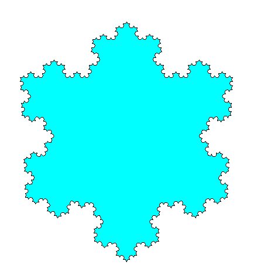

## Koch's Flake
This Python script uses Turtle to generate a snowflake (Koch's Flake) in the following image: 

There are a few adjustable parameters:

`iterations` - The number of iterations (higher values take more time)

`side` - The length of one side of the base polygon

`inverse` - If true, the flake will be generated inside out