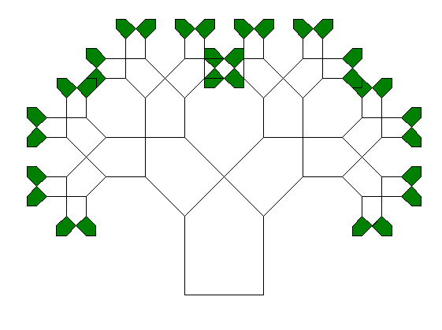

## Pythagoras's Tree
This simple Python script uses Turtle to generate a tree like in the following image: 

There are a few adjustable parameters:

`steps` - The number of iterations (higher values take more time)

`side` - The length of one side of the base polygon